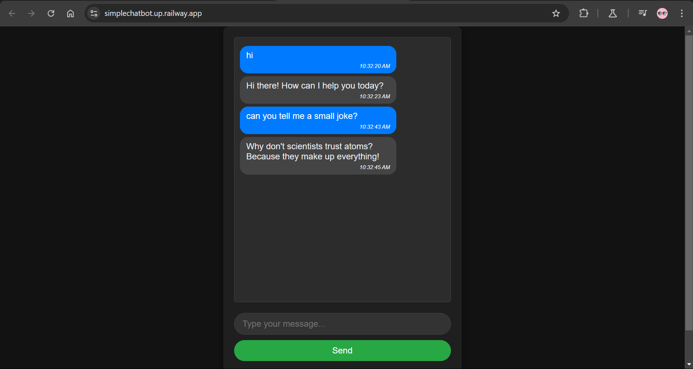
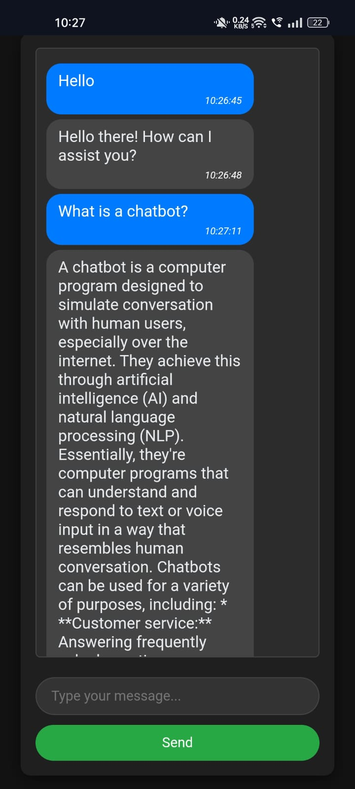

# 🚀 Chatbot Project

This project is a simple chatbot application built using Flask and the Gemini API. It was developed to conduct a session on "Chatbot Building."

---

## ✨ Features
- 🤖 Chat functionality using Gemini API.
- 🖥️ Flask backend with RESTful endpoints.
- 🔄 Dynamic responses generated by the Gemini API.
- 🌐 Hosted on Railway.

---

## 📋 Requirements

### Python Packages
Ensure the following packages are installed:
- `Flask==3.0.2`
- `Werkzeug==3.0.1`
- `google-generativeai==0.7.2`
- `python-dotenv`
- `waitress==2.1.2`

Install dependencies using:
```bash
pip install -r requirements.txt
```

### Environment Variables
Create a `.env` file in the project root with the following:
```
API_KEY=your-gemini-api-key
```
Replace `your-gemini-api-key` with your actual Gemini API key.

---

## 📂 Project Structure
```
project/
├── app.py                # Main application file
├── .env                  # Environment variables
├── requirements.txt      # Dependencies
├── Procfile              # Deployment configuration
├── templates/
│   └── index.html        # HTML template for chatbot UI
├── static/               # Folder for static assets
│   ├── css/              # CSS files
│   ├── js/               # JavaScript files
│   └── images/           # Image files
```

---

## 🏃‍♂️ Running Locally

### Steps
1. Clone the repository:
   ```bash
   git clone https://github.com/your-repo-url.git
   ```

2. Navigate to the project directory:
   ```bash
   cd project
   ```

3. Install dependencies:
   ```bash
   pip install -r requirements.txt
   ```

4. Run the application:
   ```bash
   python app.py
   ```

5. Access the chatbot at:
   ```
   http://127.0.0.1:5000
   ```

---

## 🌍 Deployment

This chatbot was hosted on **Railway**.

### Steps
1. Push your code to a GitHub repository.
2. Link the repository to Railway.
3. Add the `API_KEY` environment variable in the Railway dashboard.
4. Deploy and access the chatbot via the Railway-provided URL.

### `Procfile` for Deployment
Ensure the following `Procfile` exists in your project:
```
web: waitress-serve --port=$PORT app:app
```

---

## 🛠️ How It Works
- The application uses Flask to create a web server.
- The `/chat` endpoint handles user messages and sends them to the Gemini API.
- The Gemini API processes the input and returns a response, which is displayed to the user.

---

## 🎨 Screenshots
### Chat Interface
| Desktop View                              | Mobile View                              |
|------------------------------------------|------------------------------------------|
|  |  |

---

## 📜 License
This project is for educational purposes and is not licensed for commercial use.

---

## 👤 Author
**Sibi Siddharth S**

- 📧 Email: [sibisiddharth8@gmail.com](mailto:sibisiddharth8@gmail.com)
- 📍 Location: Coimbatore, Tamil Nadu

---

Enjoy building and exploring chatbots! 🚀
